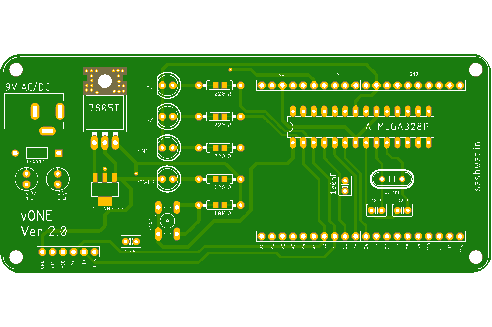

# vOne

## Introduction

My version of Arduino Uno for board isolation.

Design Tool : Autodesk Eagle PCB

## Front Design

## Bottom Design

## Drills Design

## Features

1. 5 5V pins
2. 5 3.3V pins
3. 10 ground pins
4. Extra filtering input from power source
5. FTDI support
6. Supports 9V AC and DC
